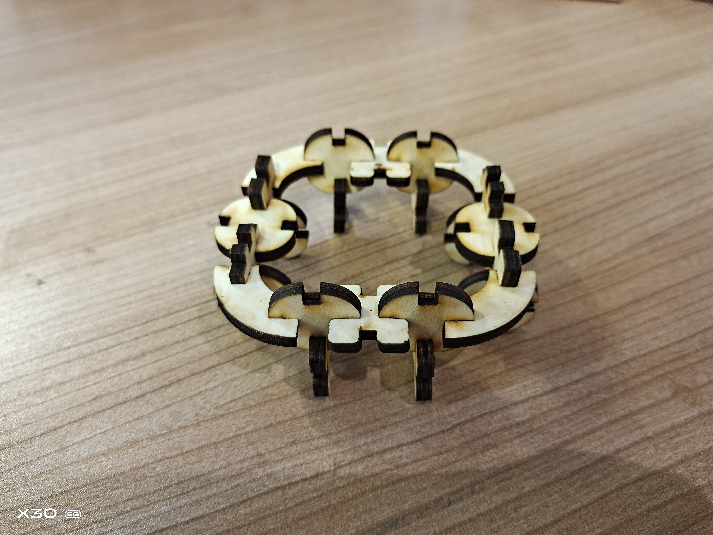
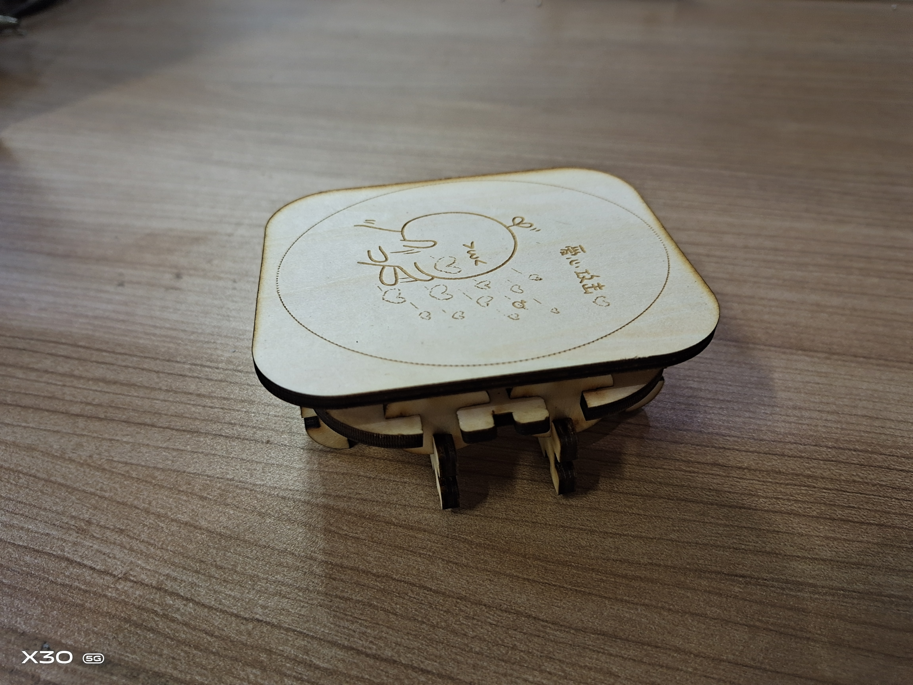
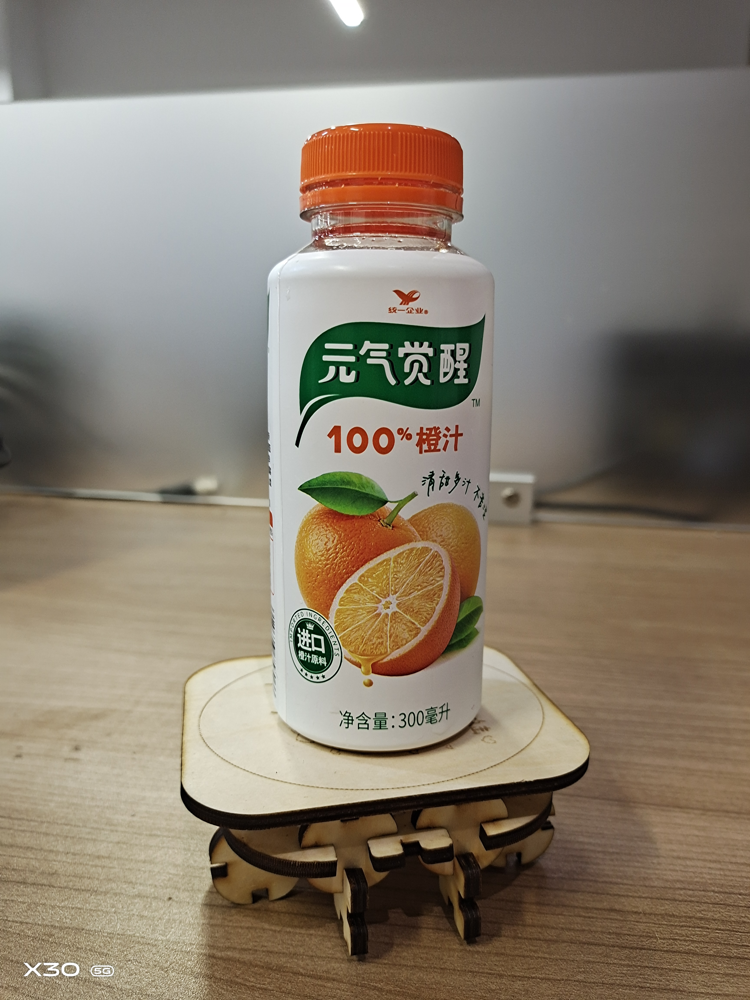
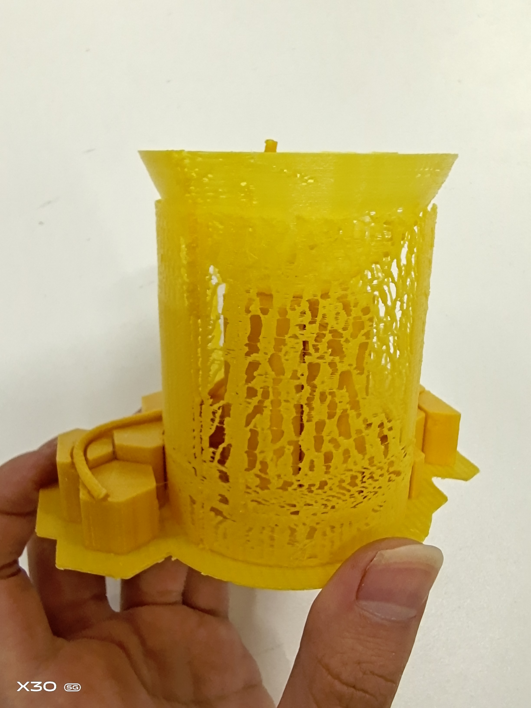
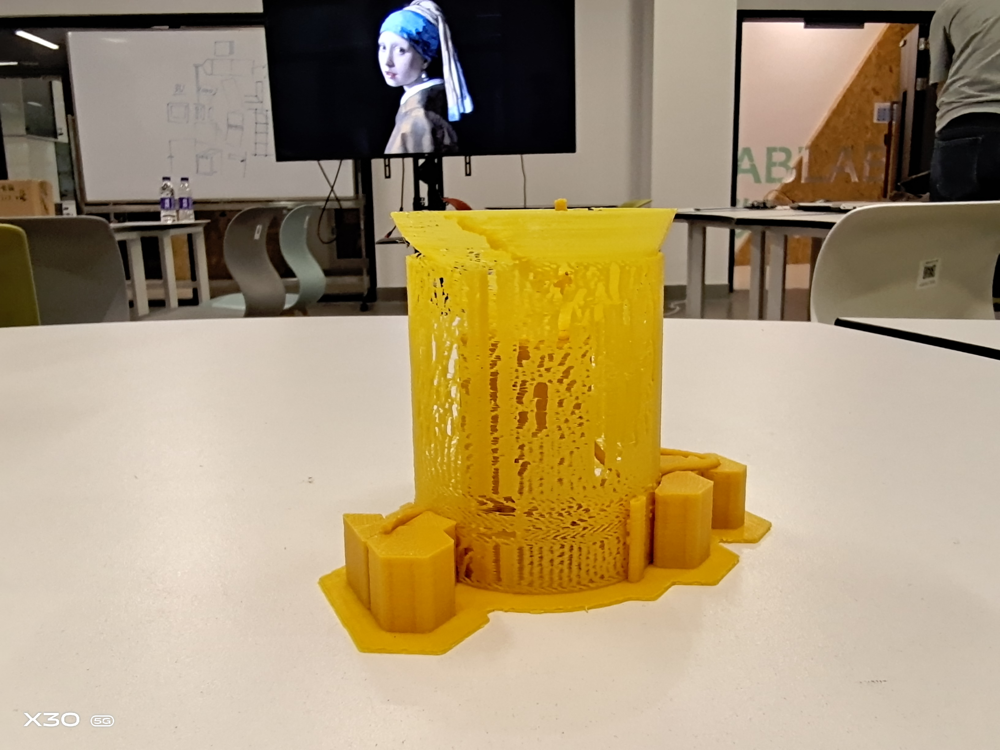
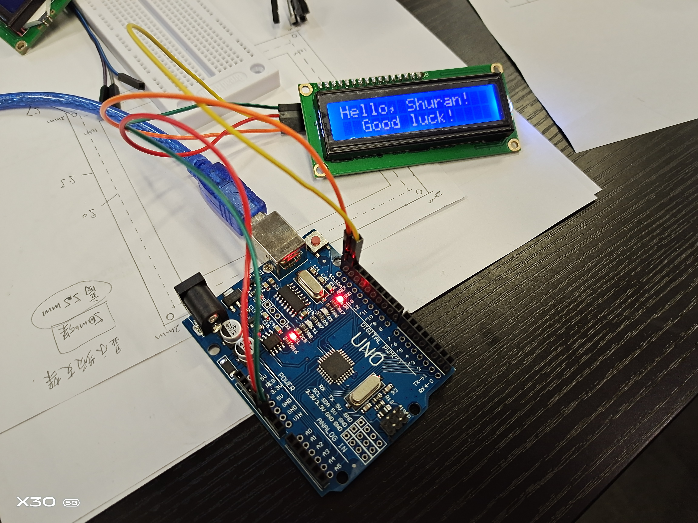

# Introduction

## About This Repository
This repository saves materials and final products of my assignments for ShanghaiTech Fablab-2020Spring.

## About Me
I am Shuran Wang, a girl majors in Life Sciences (with minor in Innovation and Entrepreneurship) at ShanghaiTech University.

## This Page
A brief description of my assignments and final project in ShanghaiTech Fablab-2020Spring.

# Assignments
Assignments for each week are organized into independent filefoders.

## Week 1: Laser-cutting
**Goal**: Using Fusion360 to design elements for laser-cutting, and integrate the elements into interesting structures: Coaster & Bookmark. 
**Sofeware**: Fusion360
**Show**: 

1. Design
  
  
  
  
  
  

2. Product
  
  
  

## Week 2: 3D Priting

**Goal**: Design an object that can not be laser-cutted: A hollowed out cup.

**Sofeware**: Fusion360; Pango

**Show**:
1. Design:
  

2. Product:
  

## Week 3: Arduino

**Goal**: Make a LCD screen say "Hello" to me.

**Show**:
The LCD screen will say "Hello Shuran, Good Luck!".

## week 4: Making A Machine

**Goal**: Assemble a scaffold of a machine that can move in two dimensions.

**Show**:
 

## week 5: 3D Scanning

**Goal**: Scan my head, adjust and 3D-print it.
**Software**: Meshmixer & 3D systems Sense

**Show**:
 

 

## Final Project: 
**Goal**: Design a cooker that can make recipes according to your mood.

**Software**: Fusion360; Arduino

**Elements**:

 

 

 

 

**Prototype**: Refer to the vedio in "Final Project Filefold".

 

 

 